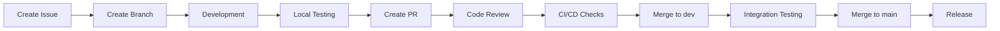

# Development Workflow für Event Countdown App

## 1. Git Branching Strategy

### 1.1 Branch Structure

```
main (production)
  └── dev (development)
        ├── feature/ISSUE-123-event-input
        ├── feature/ISSUE-124-countdown-display
        ├── bugfix/ISSUE-125-timezone-handling
        └── hotfix/ISSUE-126-critical-crash
```

### 1.2 Branch Naming Convention

- **Feature Branches**: `feature/ISSUE-{number}-{short-description}`
- **Bugfix Branches**: `bugfix/ISSUE-{number}-{short-description}`
- **Hotfix Branches**: `hotfix/ISSUE-{number}-{short-description}`
- **Release Branches**: `release/v{version}`

### 1.3 Branch Policies

#### main Branch
- Protected branch
- Represents production-ready code
- Only merge from dev or hotfix branches
- Requires PR with 2 approvals
- All CI/CD checks must pass

#### dev Branch
- Protected branch
- Integration branch for features
- Requires PR with 1 approval
- All tests must pass

#### Feature Branches
- Created from dev
- One branch per GitHub issue
- Deleted after merge

## 2. Development Process

### 2.1 Issue Creation & Planning

```markdown
## Issue Template

### Description
[Clear description of the feature/bug]

### Acceptance Criteria
- [ ] Criteria 1
- [ ] Criteria 2
- [ ] Criteria 3

### Technical Details
- Affected components:
- Dependencies:
- Estimated effort:

### Tasks
- [ ] Implementation
- [ ] Unit tests
- [ ] Integration tests
- [ ] Documentation update

### Labels
- Type: feature/bug/enhancement
- Priority: P0/P1/P2
- Component: ui/domain/data
```

### 2.2 Development Flow



### 2.3 Commit Convention

```bash
# Format
<type>(<scope>): <subject>

<body>

<footer>

# Examples
feat(countdown): add live countdown display
fix(event): handle timezone changes correctly
docs(readme): update setup instructions
test(viewmodel): add unit tests for countdown logic
refactor(data): optimize database queries
style(ui): update material design components
```

#### Commit Types
- **feat**: New feature
- **fix**: Bug fix
- **docs**: Documentation
- **style**: Formatting, missing semicolons, etc.
- **refactor**: Code restructuring
- **test**: Adding tests
- **chore**: Maintenance tasks

## 3. Pull Request Process

### 3.1 PR Template

```markdown
## Description
Brief description of changes

## Type of Change
- [ ] Bug fix
- [ ] New feature
- [ ] Breaking change
- [ ] Documentation update

## Testing
- [ ] Unit tests pass
- [ ] Integration tests pass
- [ ] Manual testing completed

## Checklist
- [ ] Code follows style guidelines
- [ ] Self-review completed
- [ ] Comments added for complex code
- [ ] Documentation updated
- [ ] No new warnings
- [ ] Tests added/updated
- [ ] All tests passing

## Screenshots (if applicable)
[Add screenshots for UI changes]

## Related Issues
Closes #123
```

### 3.2 Code Review Guidelines

#### Reviewer Checklist
- [ ] Code follows Kotlin best practices
- [ ] No hardcoded values
- [ ] Proper error handling
- [ ] Performance considerations
- [ ] Security implications
- [ ] Test coverage adequate
- [ ] Documentation clear

#### Review Comments Format
```kotlin
// 🔴 MUST FIX: Critical issue that blocks merge
// 🟡 SHOULD FIX: Important but not blocking
// 🟢 CONSIDER: Suggestion for improvement
// 💭 QUESTION: Clarification needed
// 👍 PRAISE: Good practice to highlight
```

## 4. CI/CD Pipeline

### 4.1 GitHub Actions Workflow

```yaml
name: CI/CD Pipeline

on:
  pull_request:
    branches: [dev, main]
  push:
    branches: [dev, main]

jobs:
  lint:
    runs-on: ubuntu-latest
    steps:
      - uses: actions/checkout@v3
      - name: Run Detekt
        run: ./gradlew detekt
      - name: Run KtLint
        run: ./gradlew ktlintCheck

  test:
    runs-on: ubuntu-latest
    steps:
      - uses: actions/checkout@v3
      - name: Run Unit Tests
        run: ./gradlew test
      - name: Generate Coverage Report
        run: ./gradlew jacocoTestReport
      - name: Upload Coverage
        uses: codecov/codecov-action@v3

  build:
    runs-on: ubuntu-latest
    needs: [lint, test]
    steps:
      - uses: actions/checkout@v3
      - name: Build Debug APK
        run: ./gradlew assembleDebug
      - name: Build Release APK
        run: ./gradlew assembleRelease

  ui-test:
    runs-on: macos-latest
    steps:
      - uses: actions/checkout@v3
      - name: Run UI Tests
        uses: reactivecircus/android-emulator-runner@v2
        with:
          api-level: 33
          script: ./gradlew connectedAndroidTest
```

### 4.2 Automated Checks

- **Pre-commit**: KtLint formatting
- **Pre-push**: Unit tests
- **PR Checks**: Full CI pipeline
- **Merge Checks**: Integration tests

## 5. Testing Strategy

### 5.1 Test Pyramid

```
         /\
        /UI\       (10%) - UI/E2E Tests
       /Tests\
      /-------\
     /Integration\ (20%) - Integration Tests
    /   Tests    \
   /--------------\
  /  Unit Tests   \ (70%) - Unit Tests
 /________________\
```

### 5.2 Testing Guidelines

#### Unit Tests
```kotlin
// Test file naming: ClassNameTest.kt
// Test method naming: `should_expectedBehavior_when_condition`

@Test
fun `should return error when event date is in past`() {
    // Given
    val pastDate = LocalDateTime.now().minusDays(1)
    
    // When
    val result = validator.validateEventDate(pastDate)
    
    // Then
    assertFalse(result.isValid)
    assertEquals("Date must be in future", result.error)
}
```

#### Integration Tests
```kotlin
@MediumTest
@RunWith(AndroidJUnit4::class)
class EventRepositoryIntegrationTest {
    @get:Rule
    val instantTaskExecutorRule = InstantTaskExecutorRule()
    
    private lateinit var database: EventDatabase
    private lateinit var repository: EventRepository
    
    @Before
    fun setup() {
        database = Room.inMemoryDatabaseBuilder(
            ApplicationProvider.getApplicationContext(),
            EventDatabase::class.java
        ).build()
        repository = EventRepositoryImpl(database.eventDao())
    }
}
```

### 5.3 Test Coverage Requirements

- **Overall**: Minimum 80%
- **Domain Layer**: Minimum 90%
- **Data Layer**: Minimum 85%
- **Presentation Layer**: Minimum 70%

## 6. Release Process

### 6.1 Version Numbering

```
MAJOR.MINOR.PATCH (1.2.3)

MAJOR: Breaking changes
MINOR: New features
PATCH: Bug fixes
```

### 6.2 Release Checklist

- [ ] All features complete
- [ ] All tests passing
- [ ] Documentation updated
- [ ] CHANGELOG.md updated
- [ ] Version bumped
- [ ] Release notes prepared
- [ ] APK signed
- [ ] Play Store listing updated

### 6.3 Release Workflow

```bash
# 1. Create release branch
git checkout -b release/v1.0.0 dev

# 2. Bump version
# Update version in build.gradle

# 3. Update CHANGELOG
# Add release notes

# 4. Create PR to main
# Get approvals

# 5. Merge to main
# Triggers release build

# 6. Tag release
git tag -a v1.0.0 -m "Release version 1.0.0"
git push origin v1.0.0

# 7. Deploy to Play Store
# Automated via GitHub Actions
```

## 7. Development Environment Setup

### 7.1 Required Tools

```bash
# Android Studio
Version: Hedgehog | 2023.1.1 or later

# Kotlin
Version: 1.9.20 or later

# Gradle
Version: 8.2 or later

# JDK
Version: 17 or later

# Git
Version: 2.30 or later
```

### 7.2 IDE Configuration

```kotlin
// Android Studio Settings
// Editor > Code Style > Kotlin
// Import: android-kotlin-style-guide.xml

// Plugins to install
- Detekt
- KtLint
- Rainbow Brackets
- Key Promoter X
- Git Flow Integration
```

### 7.3 Local Setup

```bash
# Clone repository
git clone https://github.com/Psheikomaniac/countjoy.git
cd countjoy

# Checkout dev branch
git checkout dev

# Install dependencies
./gradlew build

# Run tests
./gradlew test

# Run app
./gradlew installDebug
```

## 8. Code Quality Tools

### 8.1 Detekt Configuration

```yaml
# detekt.yml
build:
  maxIssues: 10
  weights:
    complexity: 2
    formatting: 1
    
complexity:
  ComplexMethod:
    threshold: 15
  LongMethod:
    threshold: 60
  TooManyFunctions:
    threshold: 20
```

### 8.2 KtLint Configuration

```kotlin
// .editorconfig
[*.{kt,kts}]
indent_size = 4
max_line_length = 120
insert_final_newline = true
```

### 8.3 SonarQube Integration

```groovy
sonarqube {
    properties {
        property "sonar.projectKey", "countjoy"
        property "sonar.organization", "psheikomaniac"
        property "sonar.host.url", "https://sonarcloud.io"
        property "sonar.sources", "src/main"
        property "sonar.tests", "src/test"
        property "sonar.coverage.jacoco.xmlReportPaths", 
                 "build/reports/jacoco/jacocoTestReport/jacocoTestReport.xml"
    }
}
```

## 9. Documentation Standards

### 9.1 Code Documentation

```kotlin
/**
 * Repository for managing countdown events.
 * 
 * This repository provides methods to create, read, update, and delete
 * countdown events. It abstracts the data source implementation details
 * from the domain layer.
 * 
 * @see EventRepositoryImpl for the concrete implementation
 */
interface EventRepository {
    /**
     * Retrieves the current countdown event.
     * 
     * @return Flow emitting the current event or null if none exists
     */
    suspend fun getEvent(): Flow<CountdownEvent?>
}
```

### 9.2 README Structure

```markdown
# Project Name

## Description
Brief project description

## Features
- Feature 1
- Feature 2

## Setup
Installation instructions

## Architecture
Architecture overview

## Contributing
Contribution guidelines

## License
License information
```

## 10. Monitoring & Analytics

### 10.1 Crashlytics Setup

```kotlin
// Application class
class CountJoyApplication : Application() {
    override fun onCreate() {
        super.onCreate()
        if (!BuildConfig.DEBUG) {
            FirebaseCrashlytics.getInstance()
                .setCrashlyticsCollectionEnabled(true)
        }
    }
}
```

### 10.2 Performance Monitoring

```kotlin
// Key metrics to track
- App startup time
- Screen render time
- Database query time
- Memory usage
- Battery consumption
```

## 11. Security Guidelines

### 11.1 Code Security

- No hardcoded API keys
- Use ProGuard/R8 for obfuscation
- Implement certificate pinning
- Secure SharedPreferences
- Input validation

### 11.2 Dependency Management

```kotlin
// Regular dependency updates
./gradlew dependencyUpdates

// Security vulnerability scanning
./gradlew dependencyCheckAnalyze
```

## 12. Team Collaboration

### 12.1 Daily Workflow

1. **Morning**: Check GitHub issues
2. **Development**: Work on assigned issues
3. **Testing**: Run local tests
4. **PR Creation**: Submit for review
5. **Review**: Review team PRs

### 12.2 Communication Channels

- **GitHub Issues**: Feature requests, bugs
- **Pull Requests**: Code discussions
- **Wiki**: Documentation
- **Discussions**: General topics

## Summary

Dieser Workflow gewährleistet:
- **Konsistente Entwicklung**: Klare Prozesse und Standards
- **Hohe Code-Qualität**: Automatisierte Checks und Reviews
- **Schnelle Iteration**: Effiziente CI/CD-Pipeline
- **Team-Kollaboration**: Strukturierte Zusammenarbeit
- **Kontinuierliche Verbesserung**: Feedback-Loops und Monitoring